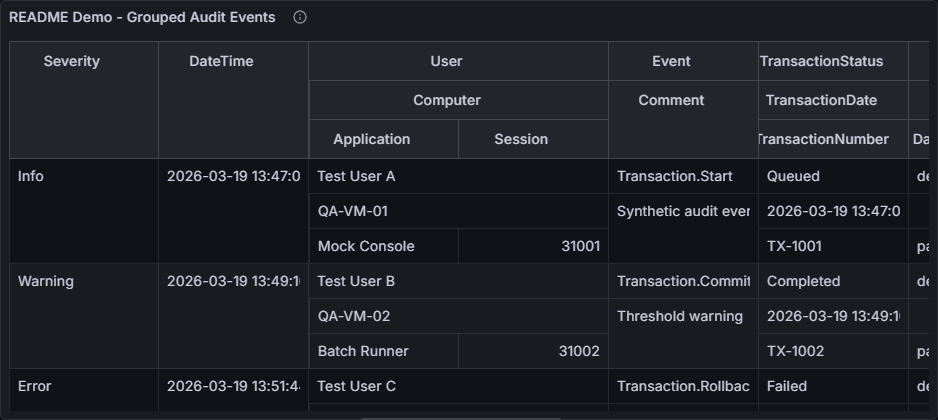
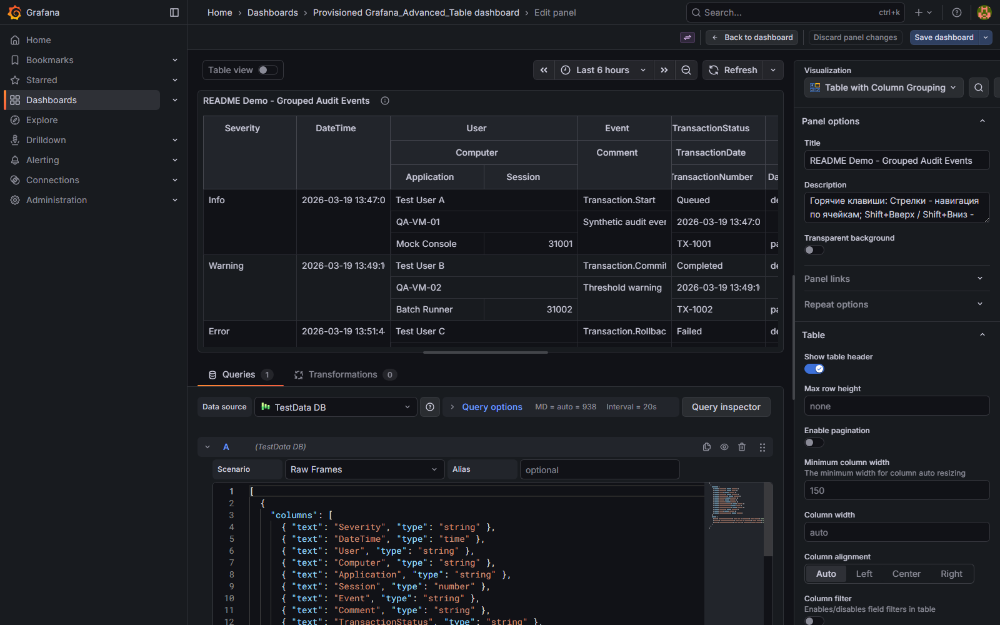

# Table with Column Grouping


`Table with Column Grouping` extends the standard Grafana table panel with configurable multi-level headers and column group layouts.

## Why this plugin

Grafana's default table is strong for flat column structures. This plugin is designed for datasets where columns belong to logical groups and need a clearer visual hierarchy.

Use it when you need:
- Multi-level column headers with nested groups
- Vertical or horizontal group orientation
- Familiar table behavior (sorting, filtering, resizing)
- A visual editor for group configuration

## Requirements

- Grafana `>= 12.2.0`

## Installation

### Grafana Catalog (after publication approval)

1. Open your Grafana instance.
2. Go to **Administration** -> **Plugins**.
3. Search for **Table with Column Grouping**.
4. Click **Install**.

### Manual installation (development / pre-release)

1. Build or download a plugin package.
2. Extract it into the Grafana plugins directory:

```bash
unzip smelentyev-tablecolumngrouping-panel-<version>.zip -d /var/lib/grafana/plugins/
```

3. Restart Grafana:

```bash
systemctl restart grafana-server
```

4. Verify installation in **Administration** -> **Plugins**.

## Quick start

1. Create (or edit) a dashboard panel.
2. Select **Table with Column Grouping** as visualization.
3. Configure your query.
4. In panel options, enable/configure column grouping.
5. Build header hierarchy in the grouping editor.
6. Fine-tune field display options and widths.

## Screenshots

### Grouped table view



### Panel editor



### No-data state


## Feature highlights

- Nested group headers with flexible depth
- Group orientation controls (vertical / horizontal)
- Integrated sorting and filtering flows
- Column resize support
- Compatible with field options and display modes

## Development

### Getting started

```bash
npm install
```

### Build

```bash
npm run build
```

### Type check

```bash
npm run typecheck
```

### Lint

```bash
npm run lint
```

### Unit tests

```bash
npm run test:ci
```

### Run Grafana locally (Docker)

```bash
npm run server
```

### E2E tests

```bash
npm run e2e
```

## Publishing notes

For Grafana catalog submission, keep these assets current:
- `README.md` (clear user-facing docs)
- `CHANGELOG.md` (release notes)
- `src/plugin.json` metadata (description, links, screenshots)

## Reviewer testing guidance

The repository includes a provisioned Grafana test environment and a sample dashboard used for validation and review.

Manual validation flow:

1. Start Grafana locally with `npm run server`.
2. Open the provisioned dashboard `Provisioned Grafana_Advanced_Table dashboard`.
3. Check panel `Grouped Columns Demo` for grouped headers and pagination behavior.
4. Check panel `Sample Panel Title` for the no-data state.
5. Check panel `Expression Filter Repro` for filter behavior.
6. In the `Session` column filter, select `Expression` and test an expression such as `$<=228556801`.
7. Confirm only matching rows remain visible and invalid expressions fail safely without executing arbitrary code.

Automated validation available in the repository:

- Unit tests: `npm run test:ci`
- E2E tests: `npm run e2e`
- Static checks: `npm run typecheck` and `npm run lint`
- Build: `npm run build`

## License

Apache-2.0. See [LICENSE](LICENSE).

## Support

- Issues: https://github.com/Smelentyev/grafana-table-column-grouping/issues
- Repository: https://github.com/Smelentyev/grafana-table-column-grouping
